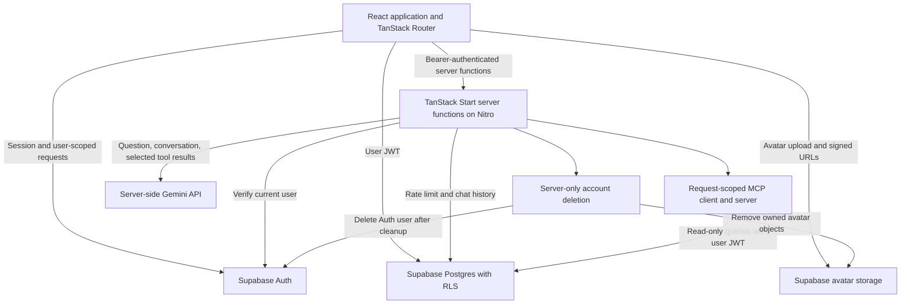

# HerCare AI

**Track your health. Understand your patterns. Get educational wellness support.**

HerCare AI brings women's health tracking, personal analytics, reports, and an AI wellness assistant into one application. It is built for the CodeBlitz 2.0 Grand Finale and supports cycle, fertility, PCOS, pregnancy, and everyday wellbeing tracking.

## Why HerCare AI

Health observations often end up scattered across notes, calendars, and separate apps. That makes it harder to remember changes, notice patterns, or prepare a useful history for a medical appointment. General chatbot advice also lacks the context of a person's recorded experiences.

HerCare AI addresses this problem with structured tracking, a shared dashboard, downloadable reports, and an assistant that can read selected records when a question needs them. Its distinguishing feature is a bounded, authenticated internal MCP workflow with visible information about which tools and records contributed to the current answer. Missing records remain unknown; the application does not turn estimates or associations into diagnoses.

## Implemented features

| Area                 | Current functionality                                                                                                                                                            |
| -------------------- | -------------------------------------------------------------------------------------------------------------------------------------------------------------------------------- |
| Health tracking      | Cycle history and estimates, symptoms, mood/energy/stress journals, fertility observations, PCOS records, and pregnancy tracking                                                 |
| Daily wellbeing      | Hydration, sleep, nutrition, exercise, medication schedules and daily confirmations, appointments, and in-app notifications                                                      |
| Insights and reports | Dashboard summaries, charts, date-range PDF reports, and JSON account-data export                                                                                                |
| Account              | Email/password authentication, signup and recovery flows, Google sign-in integration, profile/avatar editing, stored preferences, theme switching, and account-deletion workflow |
| AI assistant         | Educational conversation, saved chat history, optional read-only health-context tools, and an expandable **How HerCare AI answered** explanation for the current response        |
| Presentation         | Responsive application pages and the existing HerCare flower favicon/app icons                                                                                                   |

Public routes are `/`, `/auth`, and `/reset-password`. Fourteen authenticated pages cover the dashboard, assistant, trackers, wellness, medications, appointments, analytics, profile, and settings. Live authentication/provider behavior still requires the checks described below.

## Architecture and stack



| Layer               | Technology                                                          |
| ------------------- | ------------------------------------------------------------------- |
| Application         | React 19, TypeScript, TanStack Start/Router/Query                   |
| Build and hosting   | Vite 8, the existing Nitro 3 Vite plugin, Node.js, Vercel           |
| UI                  | Tailwind CSS 4, Radix UI primitives, Lucide icons, Motion, Recharts |
| Data and validation | Supabase Auth/Postgres/Storage, Zod, date-fns                       |
| AI                  | Gemini through Google's OpenAI-compatible chat-completions endpoint |
| Tools and reports   | Official MCP TypeScript SDK, jsPDF                                  |
| Quality checks      | TypeScript, ESLint, Prettier, Node's test runner                    |

This is a full-stack TanStack Start application. Nitro produces both static assets and the server handler; the deployment must preserve server functions and direct-route handling. The lockfile pins the installed versions, including the existing Nitro beta release.

```text
public/                  Favicons, manifest, and reusable brand icons
src/components/          Shared design components and application shell
src/routes/              Public and authenticated file-based routes
src/integrations/supabase/ Browser/server clients and auth middleware
src/lib/                 Data helpers, reports, assistant, and MCP modules
src/server.ts            Server entry and error handling
supabase/migrations/     Database schema, RLS policies, and AI rate limit
scripts/qa-local.mjs     Isolated local browser QA runner
tests/                   Journey, MCP, and release regression tests
docs/                    Release evidence and judges walkthrough
```

## AI assistant and internal MCP

1. A server function validates the question and verifies the bearer token with Supabase Auth `getUser`.
2. The authenticated `consume_ai_request` database function enforces the configured limit of 10 requests per user per minute. The server loads up to 20 previous conversation messages.
3. A request-scoped MCP client/server pair connects through the official SDK's in-memory transport, initializes, and discovers tools with `tools/list`.
4. Gemini is instructed to answer general questions without health lookups; when it requests relevant tools, the server executes them through `tools/call`. Successful results or safe failure messages are supplied to the model.
5. The completed question and answer are saved. The response includes actual tool use and record coverage for the explanation shown in the UI.

| Registered read-only tool | Available context                                                                             |
| ------------------------- | --------------------------------------------------------------------------------------------- |
| `get_cycle_history`       | Recorded cycle dates and flow                                                                 |
| `get_symptom_history`     | Symptom dates and severity; notes only when explicitly enabled                                |
| `get_mood_history`        | Mood, energy, and stress; journal text only when explicitly enabled                           |
| `get_tracking_summary`    | Date range, counts, missing categories, and specifically requested allowlisted profile fields |

Tools use the verified user's ID and a Supabase client carrying that user's JWT. Model/client-supplied identity overrides are rejected; the service-role client is never used for MCP. Queries cover at most 90 days and 200 records per history type. The optional profile read returns one row with at most eight allowlisted fields.

The orchestration permits two tool rounds and four requested calls, reuses duplicate results within a request, and retries recognized transient database failures once. Initialization/tool calls have eight-second limits; provider attempts have 30-second limits; model/MCP orchestration has a 60-second budget with cancellation and connection cleanup. Authentication, rate-limit checks, history loading, and final persistence occur outside that budget. Replies are non-streaming, so the UI shows general activity rather than individual live tool phases.

This MCP server is internal. There is no external MCP endpoint or verified external-client interoperability. Instruction safeguards treat tool results as untrusted data but cannot guarantee model behavior.

## Privacy and security

- Browser requests remain subject to Supabase RLS. Shared mutations additionally check authentication and filter by owner. Protected routes verify the current Auth user; query caches clear on sign-out.
- Server functions independently verify the user. Provider credentials and service-role administration stay in server modules. Public `VITE_` settings contain only the Supabase URL and browser-safe key.
- Assistant use sends the question, recent conversation, and selected tool context to Google's Gemini API. These records are not confined to the device. Notes/journals are omitted from tool output by default; explicit tool flags can include them.
- Operational logs contain allowlisted status, timing, counts, and request identifiers. They omit questions, health records, notes, tokens, credentials, and raw provider errors.
- Account deletion first removes bounded, owner-scoped avatar objects and stops if cleanup fails, then deletes the Auth user. Actual cloud deletion has not been tested.
- **Avatar privacy is a deployment prerequisite:** a historical migration grants bucket-wide avatar reads. A private bucket alone does not fix that policy. Verify owner-only storage access in a dedicated test project before using real avatars. Uploaded avatar links are signed for 24 hours; existing profile URLs may also reference external images.

## Local setup

Use Node.js **24.x** for parity with Vercel; the package requires Node.js **22.12 or newer**. Install npm and Git. Real integrations need a configured Supabase project and, for the assistant, a Gemini API credential. The isolated QA workflow requires neither live service.

After the finalized source is published to the target repository:

```powershell
git clone https://github.com/Rahul-Baghel01/HerCare-AI.git
cd HerCare-AI
npm ci
# Fresh checkout only: preserve any existing configured .env.
if (-not (Test-Path .env)) { Copy-Item .env.example .env }
# Edit .env with your own settings before starting real integrations.
npm run dev
```

The development URL is `http://localhost:8080`. On macOS/Linux, use `cp .env.example .env` for a fresh checkout. Keep environment files and downloaded health reports out of Git.

### Environment configuration

Use [.env.example](.env.example) as the safe template. The browser and server URL/key pairs must refer to the same Supabase project.

| Variable                                          | Scope              | Production requirement                                                                                               |
| ------------------------------------------------- | ------------------ | -------------------------------------------------------------------------------------------------------------------- |
| `VITE_SUPABASE_URL`                               | Public, build time | Required: Supabase project URL                                                                                       |
| `VITE_SUPABASE_PUBLISHABLE_KEY`                   | Public, build time | Required: browser-safe publishable key                                                                               |
| `SUPABASE_URL`                                    | Server             | Required: matching project URL                                                                                       |
| `SUPABASE_PUBLISHABLE_KEY`                        | Server             | Required: matching public key for user-authenticated requests                                                        |
| `SUPABASE_SERVICE_ROLE_KEY`                       | Server secret      | Required for account deletion; never expose through `VITE_`                                                          |
| `OPENAI_API_KEY`                                  | Server secret      | Required for the assistant: a **Gemini** API key, despite the legacy variable name                                   |
| `OPENAI_MODEL`                                    | Server, optional   | Defaults to `gemini-3.6-flash`; the current implementation accepts only this model                                   |
| `OPENAI_BASE_URL`                                 | Server, optional   | Defaults to `https://generativelanguage.googleapis.com/v1beta/openai/chat/completions`; other endpoints are rejected |
| `VITE_SUPABASE_PROJECT_ID`, `SUPABASE_PROJECT_ID` | Optional metadata  | Existing informational settings; application runtime does not read them                                              |

Set the first six variables for the complete application. Never prefix either secret with `VITE_`. Changing public build-time values requires a rebuild. No application callback URL environment variable is needed: auth redirects use the current browser origin.

### Commands and testing

```powershell
npm run dev        # Development server on port 8080
npm run typecheck  # TypeScript
npm run lint       # ESLint, including source-format checks
npm test           # Local automated tests
npm run build      # Normal Node production build
npm run preview    # Serve that build on port 3000; loads local .env if present
npm run qa:local   # Synthetic application on 127.0.0.1:8091
```

For isolated browser QA, use `judge@example.test` / `qa-password-123`, which are synthetic fixture credentials. The runner starts an in-memory Supabase-shaped service on port 54321, supplies mock provider responses, overrides settings only in the runner process, and blocks external server fetches. Stop with Ctrl+C; records disappear when the runner stops. These fixtures are development tools, not production services.

The prior release checks passed clean installation, TypeScript, ESLint, **37 tests**, production build, dependency audit with zero reported vulnerabilities, **17 routes**, and **83 asset paths**. External-service tests were mocked. See [release evidence](docs/RELEASE_AUDIT.md), [deployment-readiness evidence](docs/VERCEL_READINESS.md), and the [judges walkthrough](docs/JUDGES_DEMO.md). Earlier October 2 reviews are historical. The earlier submission ZIP predates the final deployment documentation.

## Supabase and authentication setup

Review `supabase/migrations` and test them in a dedicated nonproduction project before applying approved changes to production. Verify user-owned table RLS, profile creation, Auth deletion cascades, and `consume_ai_request`; the rate-limit function is required for the assistant. Provision the `avatars` bucket separately and resolve the historical permissive read policy with verified owner-only policies. This preparation does not apply migrations or change remote data.

In **Supabase Authentication > URL Configuration**:

- Set **Site URL** to the actual HTTPS production origin, for example `https://<your-production-host>`.
- Allow `https://<your-production-host>/dashboard` for signup confirmation and Google sign-in.
- Allow `https://<your-production-host>/reset-password` for password recovery.
- For local integration work, allow `http://localhost:8080/dashboard` and `http://localhost:8080/reset-password`; add port 3000 equivalents if testing a normal production preview.
- Add exact preview-host URLs when needed, or a narrowly scoped project/team pattern. Avoid a wildcard covering every Vercel deployment.

Enable Google under **Supabase Authentication > Providers**. Configure the Google client ID/secret there, and register the Supabase callback shown in that panel in Google Cloud, normally `https://<project-ref>.supabase.co/auth/v1/callback`. The app has no `/auth/callback` route. See the official [redirect URL guide](https://supabase.com/docs/guides/auth/redirect-urls) and [Google provider guide](https://supabase.com/docs/guides/auth/social-login/auth-google).

Browser sessions persist in local storage and refresh through the Supabase client. Authenticated application routes disable SSR and verify the current user; server functions verify bearer tokens separately. This application does not implement a cookie-based SSR session or a custom PKCE callback exchange.

## Deploy to Vercel

Publish the reviewed source to GitHub first. Deployment remains manual.

1. Open [Vercel](https://vercel.com), choose **Add New > Project**, and import **Rahul-Baghel01/HerCare-AI**.
2. Confirm the settings below. The existing Nitro plugin detects Vercel and produces the server/static output; no `vercel.json` or additional adapter is required.
3. Add the environment values from the table to **Production**, and separately to **Preview** only for the project intended for preview testing. Keep production and test projects distinct.
4. Configure the Supabase Site URL and allowed redirects for the actual deployment hostname. If the hostname is not yet known, deploy first, record it, then complete URL configuration before authentication testing.
5. Choose **Deploy**. Check build logs and runtime logs using synthetic questions/records. Rebuild after correcting a public build-time variable.
6. Open the production URL and verify the checks below using a dedicated test account and fictional records.

| Vercel setting     | Value                                                                                                      |
| ------------------ | ---------------------------------------------------------------------------------------------------------- |
| Framework Preset   | **TanStack Start**                                                                                         |
| Root Directory     | Repository root (`./`)                                                                                     |
| Install Command    | `npm ci`                                                                                                   |
| Build Command      | `npm run build`                                                                                            |
| Output Directory   | Framework default; **override disabled**                                                                   |
| Node.js Version    | **24.x**                                                                                                   |
| Production Branch  | `main`, once the Git release is resolved                                                                   |
| Function execution | Keep **Fluid compute enabled** and the platform's default duration; do not impose a 60-second function cap |

Follow the official [TanStack Start deployment guide](https://vercel.com/kb/guide/deploy-a-tanstack-start-app-to-vercel), [Nitro Vercel adapter documentation](https://nitro.build/deploy/providers/vercel), and [function duration guidance](https://vercel.com/docs/functions/configuring-functions/duration). Deploy repository source so Vercel builds for its environment; do not upload Windows-generated function output as a prebuilt deployment.

### Production acceptance checks

Using approved nonproduction services/test accounts, verify signup/confirmation, sign-in/out, recovery, Google OAuth, and session persistence. Refresh `/dashboard` and another protected route directly, confirm signed-out redirects, then check every tracker, saved records, assistant replies/context/failure handling, PDF/JSON reports, and favicon/manifest paths. Test isolation between two users, private avatar reads/writes, account cleanup/deletion, and real rate-limit enforcement. Reconfirm the production hostname's auth redirects after switching domains.

Local adapter output verifies packaging and routing structure; it does not establish successful Vercel hosting or live service behavior.

## Known limitations and medical safety

- Live Supabase, Gemini, deployed RLS, email/OAuth, private avatar storage, cloud account deletion, and rate limiting remain unverified. Resolve the avatar privacy prerequisite before a real-data release.
- Cycle/fertility predictions are estimates, with no contraception guarantee. PCOS and pregnancy tracking do not provide diagnosis or treatment.
- Medication confirmation is per day, rather than per scheduled dose. Reminder/research settings store preferences; automatic reminder delivery and research data transfer are not configured.
- Measurement entry uses metric units. Assistant responses do not stream; historical chats do not retain the current response's tool explanation. There is no user-facing cancellation control.
- Mock tests cannot certify cloud policies or provider behavior. Prompt-injection safeguards do not guarantee safe model responses.

**HerCare AI provides educational wellness support and does not replace professional medical care.** It is not clinically validated and must not be used to diagnose conditions, prescribe treatment, or manage emergencies. Seek professional care for health concerns and urgent in-person help for red flags.

## Planned improvements

Future work includes streaming responses with clearer progress/cancellation, configurable medication-dose confirmations and reminder delivery, more flexible units, and broader accessibility and real-service regression coverage. These are planned improvements, not implemented features.
